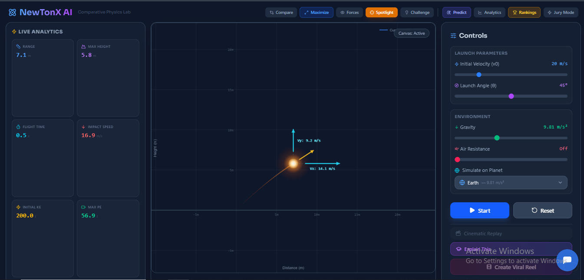
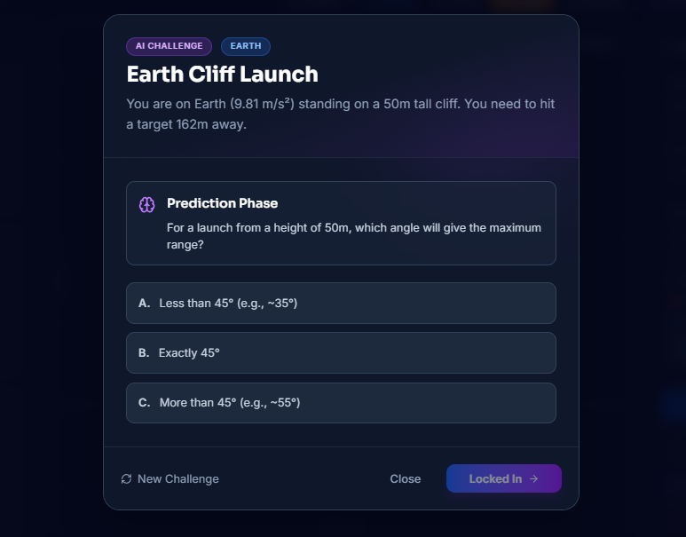
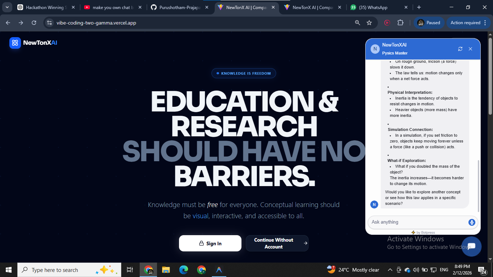
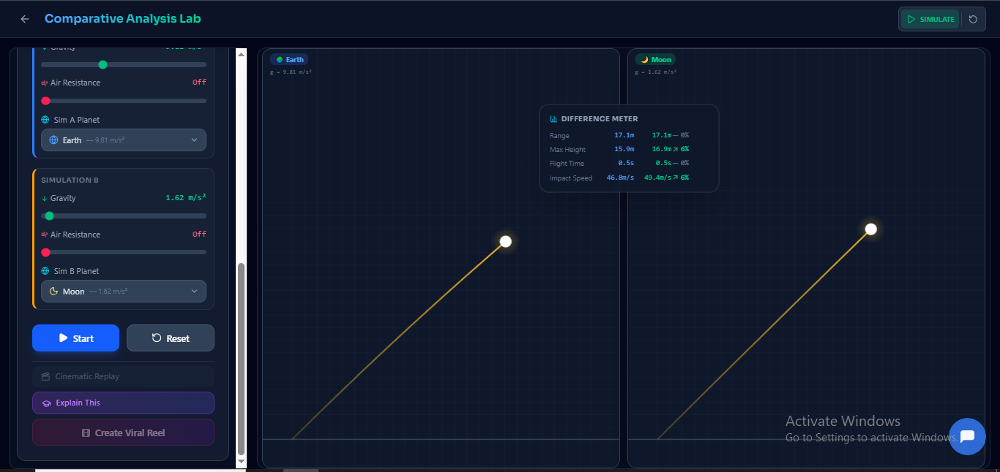
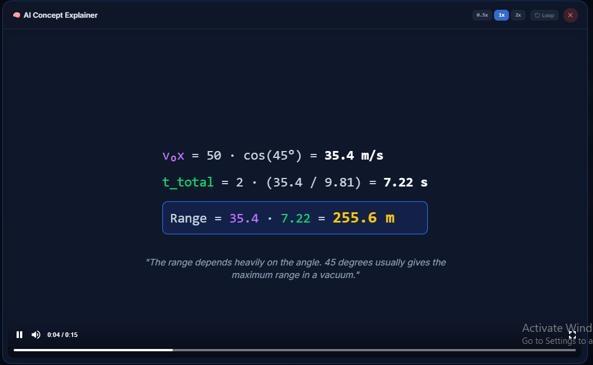
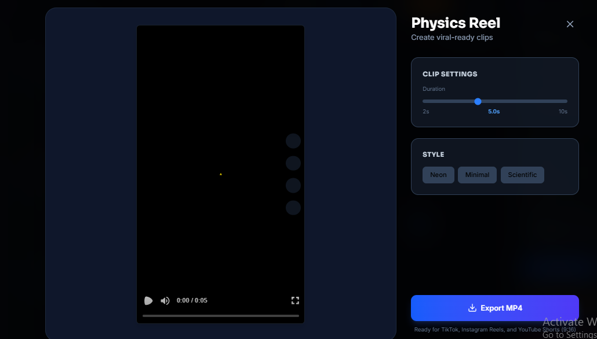

# NewtonX AI - Interactive Physics Problem Solver

## 1. Project Title
**NewtonX AI**

## 2. Description
NewtonX AI is an intelligent, AI-powered educational platform designed to bridge the gap between abstract physics concepts and intuitive understanding.

STEM learners often struggle with complex word problems that require mental visualization of motion, forces, and relationships. Traditional tools rely on static text, which limits exploration.

**NewtonX AI solves this by:**
- Accepting **natural language** physics word problems as input.
- Automatically extracting key parameters (mass, velocity, angle, gravity).
- Generating **interactive visual simulations** in real-time.
- Allowing users to explore **"what-if" scenarios** by manipulating variables and instantly observing the effects.

The system transforms static textbook problems into dynamic, explorable models, fostering deeper conceptual understanding.

## 3. Tech Stack Used
- **Frontend Framework:** React 19 (Vite)
- **Styling:** Tailwind CSS v4
- **AI Integration:** Google Gemini API (`@google/generative-ai`)
- **Animation & Physics:** GSAP (GreenSock), Framer Motion
- **Video Generation:** Remotion
- **Charting:** Chart.js, React-Chartjs-2
- **Routing:** React Router DOM
- **Icons:** Lucide React
- **Flow/Diagrams:** React Flow

## 4. How to Run the Project

### Prerequisites
- Node.js (v18 or higher)
- npm or yarn

### Installation Steps

1. **Clone the repository:**
   ```bash
   git clone <repository-url>
   cd vibecoding
   ```

2. **Install dependencies:**
   ```bash
   npm install
   ```

3. **Set up Environment Variables:**
   Create a `.env` file in the root directory and add your Google Gemini API key:
   ```env
   VITE_GEMINI_API_KEY=your_api_key_here
   ```

4. **Run the development server:**
   ```bash
   npm run dev
   ```

5. **Open the application:**
   Visit `http://localhost:5173` in your browser.

## 5. Dependencies
Key dependencies included in the project:
- `@google/generative-ai`: For interpreting natural language physics problems.
- `react`, `react-dom`, `react-router-dom`: Core application framework.
- `tailwindcss`, `@tailwindcss/vite`: Utility-first styling.
- `gsap`, `framer-motion`: High-performance animations.
- `remotion`: Programmatic video creation for replaying simulations.
- `chart.js`, `react-chartjs-2`: Data visualization for physics graphs.
- `lucide-react`: Modern icon set.

## 6. Important Instructions
- **AI Features:** The "AI Problem Solver" requires a valid internet connection and a working Gemini API key to function.
- **Simulation Control:** You can modify parameters (velocity, angle, etc.) using the sliders in the control panel even after the AI has set the initial values.
- **Responsiveness:** The layout is optimized for desktop and tablet views to accommodate the complex simulation canvas and controls.

## 7. Demo Images of MVP

### 1. Interactive Physics Dashboard

*Real-time projectile motion simulation with live parameter controls and analytics.*

### 2. AI Challenge Mode

*Adaptive difficulty challenges powered by AI to test physics intuition.*

### 3. AI Tutor Chat & Landing Page

*Interactive AI tutor explaining physics concepts in a conversational interface.*


### 4. Comparative Analysis Lab

*Compare simulations side-by-side (e.g., Earth vs. Moon) to visualize environmental differences.*

### 5. AI Concept Explainer

[AI Concept Explainer](demo/ai.png)
*Deep-dive video explanations generated by AI to break down the math behind the motion.*

### 6. Viral Physics Reels

*Export your simulations as vertical videos ready for social media sharing.*


---
**Developed for the Hackathon/Project Submission**
